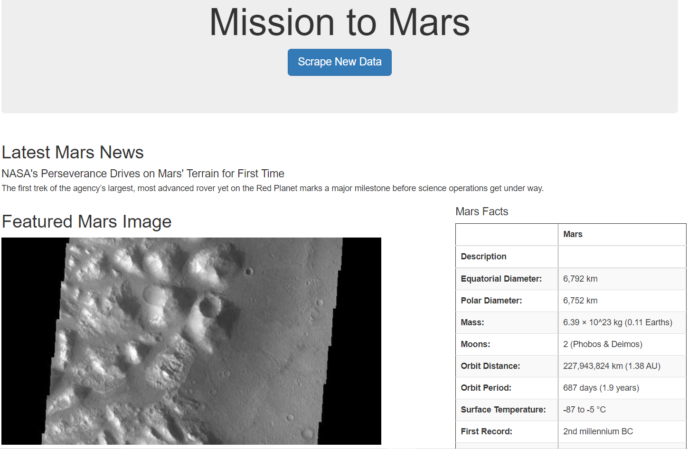
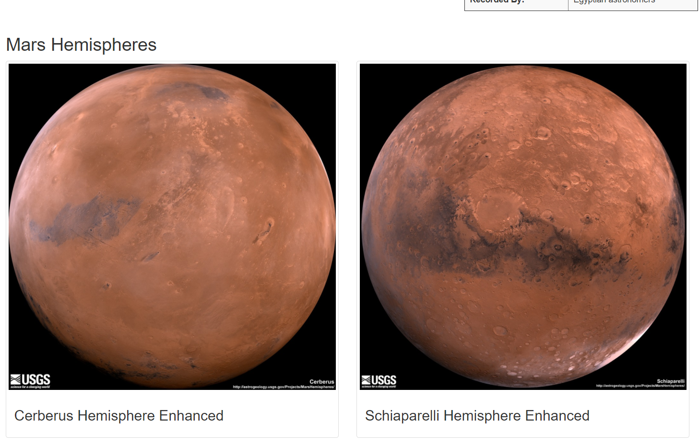
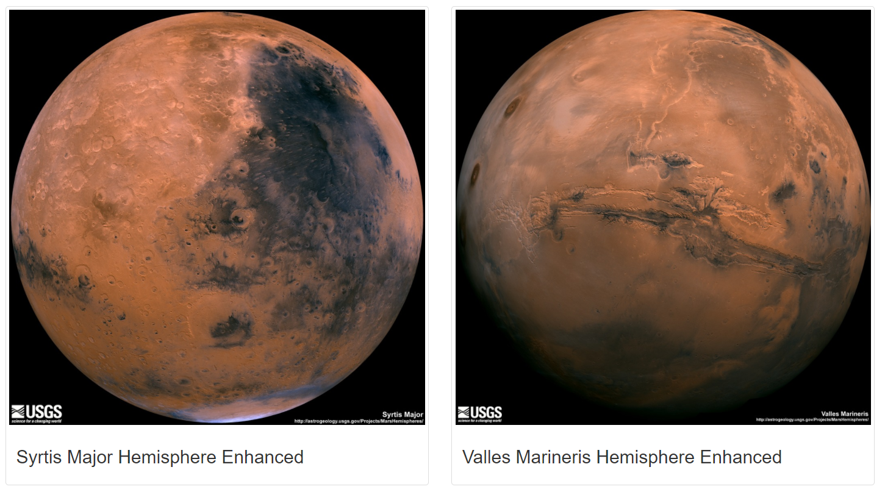

# Mission-to-Mars
In this Challenge I scraped the four Mars hemesphire images using BeautifulSoup and Splinter and captured the full size images and titles.  The files were then stored in Mongo DB, and then displayed using app.py file .

 

